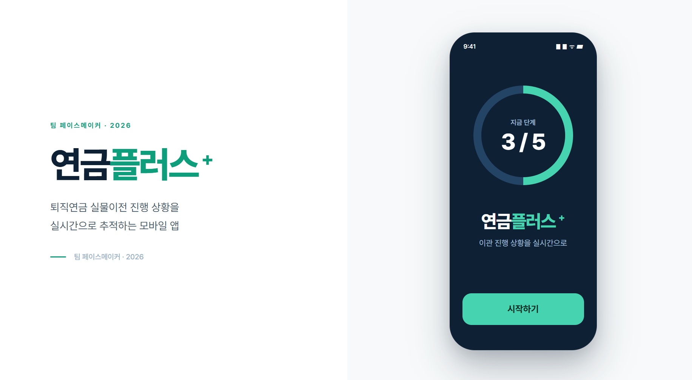

<div align="center">
  
  <br /><br />
  <b>복잡한 퇴직연금 이관 과정을 한눈에, 연금 인출 결과를 미리.</b>
  <br /><br />
  <a href="https://pension-plus.vercel.app"><b>서비스 소개</b></a>
  &nbsp;·&nbsp;
  <a href="https://pension-plus.vercel.app/app"><b>모바일 앱 체험</b></a>
</div>

<p align="center">
  
  
  
  
  
</p>

---

## ❤️ 프로젝트 개요

퇴직연금 이관을 신청한 사용자는 종종 **‘신청중’이라는 한 줄의 상태만** 마주합니다. 지금 어느 기관에서 처리 중인지, 언제 다음 단계로 넘어가는지, 매매 제한은 언제 풀리는지 알기 어렵습니다.

**연금플러스+**는 PB의 도움 없이 연금 업무를 직접 처리하는 사용자를 위한 모바일 웹 MVP입니다. 이관 과정을 단계별로 보여주고, 연금 외 수령(중도인출) 전에는 인출 순서와 예상 세금·실수령액을 미리 계산합니다.

---

## 🔑 주요 기능

<details open>
<summary><b>퇴직연금 이관 진행 상황판</b></summary>
<br />
이전할 계좌와 보유 종목을 확인하고 종목별 이전 가능 여부와 주의사항을 안내합니다. 신청 후에는 5단계 타임라인에서 현재 처리 기관, 예상 완료 시점, 매매 제한 정보를 함께 확인할 수 있습니다.
</details>

<details open>
<summary><b>연금 외 수령 모의계산</b></summary>
<br />
희망 인출 금액을 입력하면 법정 인출 순서에 따라 재원별 차감액을 계산합니다. 총 예상 세금과 실수령액을 한 화면에 보여줘 인출 전에 결과를 이해할 수 있도록 돕습니다.
</details>

<details open>
<summary><b>모바일 중심의 연결된 사용자 흐름</b></summary>
<br />
온보딩과 인증서 선택부터 홈, 이관 현황 확인, 인출 모의계산까지 하나의 흐름으로 체험할 수 있습니다. 393px 모바일 화면을 우선해 설계했습니다.
</details>

---

## 📱 사용자 흐름

```text
시작 → 서비스 소개 → 인증서 연결 안내 → 홈
                                  ├─ 퇴직연금 가져오기 → 보유 종목 확인 → 이관 현황
                                  └─ 연금저축 관리 → 인출 조건 입력 → 모의계산 결과
```

---

## 🛠️ 기술 및 구조

| 구분 | 사용 기술 |
|---|---|
| Frontend | React 19, TypeScript 6, Tailwind CSS 4 |
| Build | Vite 8 |
| Routing | React Router 8 |
| Test | Vitest 4, Oxlint |
| Data | Local TypeScript mock data |
| Deploy | Vercel |

- 계산 규칙을 React 화면과 분리해 독립적으로 테스트했습니다.
- 기능별 mock 데이터를 분리해 향후 API 연결 지점을 명확하게 만들었습니다.
- SPA rewrite를 적용해 하위 주소 직접 진입과 새로고침을 지원합니다.

---

## ⚠️ MVP 범위

이 프로젝트는 4일 안에 핵심 사용자 가설을 검증하기 위한 **시연용 MVP**입니다.

- 모든 계좌·잔액·이관 정보는 시연용 데이터입니다.
- 실제 계정 생성, 본인 인증, 계좌 연결은 진행되지 않습니다.
- 실제 이체·출금·주문 및 금융기관 API는 제공하지 않습니다.
- 계산 결과는 모의계산이며 실제 세금·수령액과 다를 수 있습니다.

---

## 🚀 로컬 실행

<details>
<summary><b>실행 방법 보기</b></summary>

Node.js 24 LTS가 필요합니다.

```bash
git clone https://github.com/YseungY/pension-plus.git
cd pension-plus
npm install
npm run dev
```

터미널에 표시된 주소의 `/app`에서 시연을 시작할 수 있습니다.
</details>

---

## 📚 프로젝트 문서

- [MVP PRD](docs/submission/PRD_MVP.md)
- [SRS Lite](docs/submission/SRS_MVP.md)
- [기술 학습 기록](docs/submission/TECH_LEARNING_PLAN.md)
- [AI 협업 기록](docs/submission/AI_WORKFLOW_LOG.md)
- [전체 문서 인덱스](docs/README.md)

---

## 👥 팀 페이스메이커

| 역할 | 담당자 |
|---|---|
| 공통 기반 · 통합 · 배포 · 문서 | 양승연 |
| 기능1 · 퇴직연금 이관 현황판 | 유고은 |
| 기능2 · 연금 외 수령 모의계산 | 김동건 |

<p align="center"><b>연금플러스+ · 2026</b></p>
